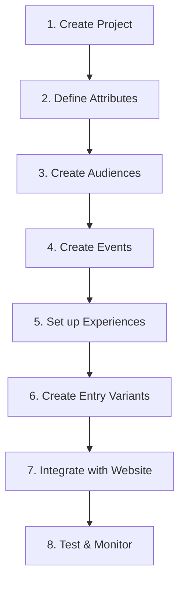

# Contentstack Personalize Documentation

Complete guide to setting up and using Contentstack Personalize for delivering real-time, data-driven personalized experiences.

## 📚 What is Contentstack Personalize?

Contentstack Personalize is an edge-optimized personalization engine that enables you to deliver real-time, data-driven content efficiently and create personalized experiences without heavy developer dependencies.

**Key Features:**
- **A/B Testing**: Test different content variations to optimize engagement
- **Segmented Experiences**: Deliver targeted content to specific audience segments
- **Edge Optimization**: Fast, low-latency personalization at the edge
- **Entry Variants**: Create content variations within Contentstack
- **Real-time Analytics**: Track experience performance and conversions

---

## 🚀 Getting Started

### Prerequisites

Before you begin with Personalize, ensure you have:
- ✅ Active Contentstack account
- ✅ Personalize enabled for your organization ([contact support](https://www.contentstack.com/support) to enable)
- ✅ Next.js 14+ application with App Router
- ✅ Website deployed on Vercel or Launch

### Documentation Structure

This guide is organized into the following sections:

1. **[Project Setup](./setup-project)** - Create and configure your Personalize project
2. **[Attributes](./attributes)** - Define and manage custom user attributes
3. **[Audiences](./audiences)** - Create audience segments for targeting
4. **[Experiences](./experiences)** - Set up A/B tests and segmented experiences
5. **[Events](./events)** - Track user actions and conversions
6. **[Variants](./variants)** - Create entry variants in Contentstack
7. **[Website Integration](./website-integration)** - Integrate Personalize into your Next.js app

---

## 📖 Quick Links

### Common Tasks

| Task | Documentation | Time Required |
|------|--------------|---------------|
| Create Personalize Project | [Setup Project](./setup-project) | 5 minutes |
| Add Custom Attribute | [Create Attribute](./attributes) | 2 minutes |
| Create Audience Segment | [Create Audience](./audiences) | 5 minutes |
| Set up A/B Test | [A/B Test Experience](./experiences#ab-test) | 10 minutes |
| Set up Segmented Experience | [Segmented Experience](./experiences#segmented) | 10 minutes |
| Track User Events | [Create Event](./events) | 3 minutes |
| Integrate with Website | [Website Integration](./website-integration) | 30 minutes |

### Official Resources

- [Contentstack Personalize Overview](https://www.contentstack.com/docs/personalize)
- [Personalize Management API](https://www.contentstack.com/docs/developers/apis/personalize-management-api)
- [Personalize Edge SDK](https://www.contentstack.com/docs/developers/personalize/personalize-edge-sdk)
- [Next.js + Vercel Setup](https://www.contentstack.com/docs/personalize/setup-nextjs-website-with-personalize-vercel)

---

## 🎯 Typical Workflow

Here's the recommended order for setting up personalization:



### Workflow Explanation

1. **Create Project**: Set up your Personalize project and connect it to your stack
2. **Define Attributes**: Create custom attributes to track user characteristics (e.g., `utm_source`, `age`, `location`)
3. **Create Audiences**: Define audience segments based on attributes (e.g., "Premium Users", "Mobile Visitors")
4. **Create Events**: Set up conversion events to track (e.g., "Button Click", "Form Submit")
5. **Set up Experiences**: Create A/B tests or segmented experiences
6. **Create Entry Variants**: Build content variations in Contentstack
7. **Integrate with Website**: Add Personalize SDK to your Next.js app
8. **Test & Monitor**: Verify implementation and track analytics

---

## 🎨 Key Concepts

### Attributes
User characteristics or behaviors you want to track. Examples:
- **Standard**: Browser, Device, Location, Referrer
- **Custom**: Age, Subscription Tier, Purchase History, UTM Parameters

### Audiences
Groups of users defined by attribute conditions. Examples:
- Premium subscribers
- Mobile users from California
- Users from Google Ads campaigns

### Experiences
Personalization campaigns. Two types:
- **A/B Tests**: Compare multiple variants to find the best performer
- **Segmented**: Show specific content to targeted audiences

### Events
User actions to track. Examples:
- Page views
- Button clicks
- Form submissions
- Purchases

### Variants
Different versions of content entries. Created in Contentstack and delivered based on experience configuration.

---

## 💡 Use Cases

### 1. Marketing Campaign Optimization
**Scenario**: Test different hero banners for a product launch

**Setup**:
1. Create attribute: `utm_source`
2. Create A/B test experience with 2 variants
3. Create entry variants for hero banner
4. Track "Learn More" click event
5. Analyze which variant converts better

### 2. Personalized Content for Segments
**Scenario**: Show premium content to paid subscribers

**Setup**:
1. Create attribute: `subscription_tier`
2. Create audience: "Premium Users" (subscription_tier = "premium")
3. Create segmented experience
4. Create entry variant with premium content
5. Deliver automatically to premium users

### 3. Geographic Targeting
**Scenario**: Show region-specific promotions

**Setup**:
1. Use built-in location attributes
2. Create audiences by region/country
3. Create segmented experiences per region
4. Create entry variants with regional content

### 4. Traffic Source Optimization
**Scenario**: Optimize content for different traffic sources

**Setup**:
1. Create attributes: `utm_source`, `utm_medium`, `utm_campaign`
2. Create audiences per traffic source
3. Create A/B tests for each source
4. Compare performance across sources

---

## 🔧 Technical Architecture

### High-Level Architecture

```
┌─────────────────────────────────────────────────────┐
│                   User Browser                      │
│  ┌───────────────────────────────────────────────┐ │
│  │  Your Next.js App (with Personalize SDK)     │ │
│  └───────────────┬───────────────────────────────┘ │
└──────────────────┼──────────────────────────────────┘
                   │
                   ├─────────────────┐
                   │                 │
                   ▼                 ▼
    ┌──────────────────────┐  ┌──────────────────┐
    │  Personalize Edge    │  │  Contentstack    │
    │       API            │  │   Delivery API   │
    │  (User Manifest)     │  │ (Entry Variants) │
    └──────────────────────┘  └──────────────────┘
                   │                 │
                   └────────┬────────┘
                            │
                            ▼
              ┌──────────────────────────┐
              │  Personalize Management  │
              │         (UI/API)         │
              │ - Projects               │
              │ - Attributes             │
              │ - Audiences              │
              │ - Experiences            │
              │ - Events                 │
              │ - Analytics              │
              └──────────────────────────┘
```

### Request Flow

1. **Page Load**: User visits your Next.js website
2. **Middleware**: Next.js middleware intercepts the request
3. **SDK Init**: Personalize SDK initializes with user context
4. **Manifest Fetch**: SDK fetches user manifest from Edge API
5. **Variant Selection**: Manifest contains selected variants for active experiences
6. **Content Fetch**: Next.js fetches entry variant from Contentstack
7. **Page Render**: Page renders with personalized content
8. **Event Tracking**: SDK tracks impressions and conversion events

---

## 🚨 Important Notes

### Limitations
- **Attributes**: 100 custom attributes per project (default)
- **Experiences**: No hard limit, but consider performance
- **Variants**: Up to 10 variants per A/B test
- **Token Expiry**: OAuth tokens expire after 60 minutes

### Best Practices
- ✅ **Start Simple**: Begin with one A/B test, expand gradually
- ✅ **Test Thoroughly**: Always test in preview before activating
- ✅ **Monitor Analytics**: Check experience performance regularly
- ✅ **Use Meaningful Names**: Name attributes, audiences, and experiences clearly
- ✅ **Document Decisions**: Keep track of why you create certain segments
- ❌ **Don't Over-Segment**: Too many audiences can be hard to manage
- ❌ **Don't Skip Events**: Always set up conversion tracking
- ❌ **Don't Forget Mobile**: Test experiences on all devices

---

## 🆘 Getting Help

### Support Channels
- **Contentstack Support**: [https://www.contentstack.com/support](https://www.contentstack.com/support)
- **Community Forum**: [https://www.contentstack.com/community](https://www.contentstack.com/community)
- **Documentation**: [https://www.contentstack.com/docs/personalize](https://www.contentstack.com/docs/personalize)

### Troubleshooting
If you encounter issues, check the [Troubleshooting Guide](./troubleshooting) for common problems and solutions.

---

## 📊 Next Steps

Ready to get started? Follow this sequence:

1. **[Create Your Project](./setup-project)** - Set up Personalize project (5 min)
2. **[Add Attributes](./attributes)** - Define user characteristics (10 min)
3. **[Create Audiences](./audiences)** - Set up audience segments (10 min)
4. **[Set up Experience](./experiences)** - Create your first A/B test (15 min)
5. **[Integrate Website](./website-integration)** - Add SDK to your app (30 min)

**Total Time**: ~70 minutes to go from zero to your first personalized experience!

---

**Ready to personalize?** [Start with Project Setup →](./setup-project)

