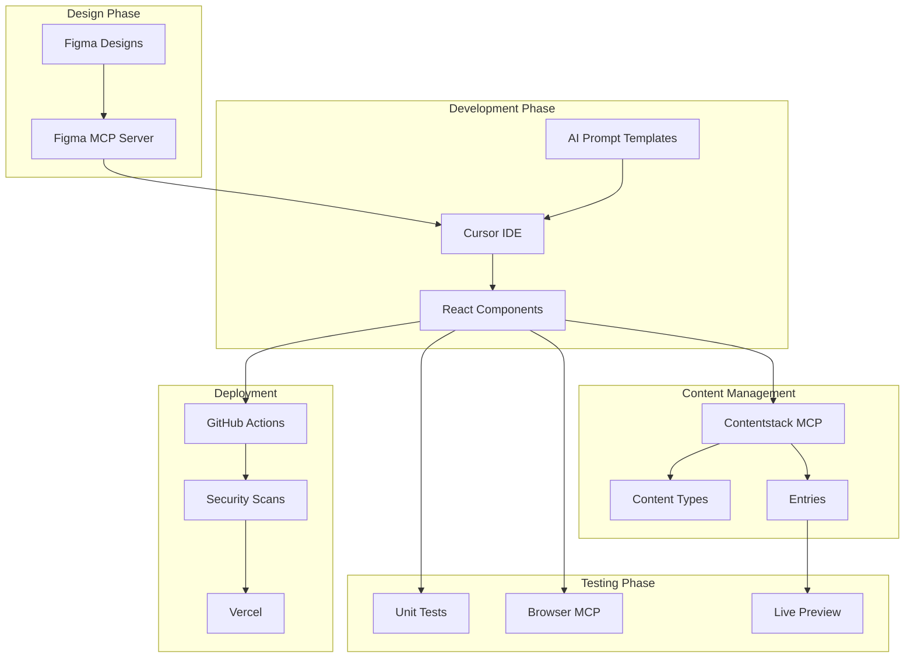

# AI in SDLC using Contentstack - Slide Deck

> **Webinar Title:** Accelerating SDLC with AI: A Deep Dive into Contentstack FastLane
> **Duration:** 60-75 minutes
> **Format:** This markdown can be converted to PowerPoint/Google Slides using tools like Marp, Slidev, or manual copy-paste

---

## Slide 1: Title Slide

# Accelerating SDLC with AI
## A Deep Dive into Contentstack FastLane

**Presenters:** [Your Name]
**Date:** [Webinar Date]

*Transforming Software Development with AI-Powered Workflows*

---

## Slide 2: Agenda Overview

### What We'll Cover Today

1. **The AI Revolution in SDLC** (10 min)
   - Traditional vs AI-augmented workflows
   
2. **AI Integration Architecture** (15 min)
   - MCP Servers and the AI Bridge
   
3. **Design-to-Code Workflow** (15 min)
   - Figma + AI Prompts = Production Code
   
4. **Content Management Automation** (10 min)
   - Contentstack MCP Server in Action
   
5. **Personalization & Analytics** (10 min)
   - Lytics + Contentstack Personalize
   
6. **Live Demo** (10 min)
   - End-to-end component creation

---

## Slide 3: The Problem We're Solving

### Traditional SDLC Challenges

| Challenge | Impact |
|-----------|--------|
| Manual design translation | Hours of tedious work |
| Inconsistent implementations | Technical debt |
| Slow content type creation | Bottlenecks |
| Repetitive testing code | Developer fatigue |
| Context switching | Lost productivity |

### The AI Solution

> **AI doesn't replace developers - it accelerates them**

- Design-to-code in minutes, not hours
- Consistent, pattern-compliant code
- Automated content management
- AI-generated tests

---

## Slide 4: What is FastLane?

### Next.js + Contentstack Starter Kit with AI Integration

**Core Technologies:**
- Next.js 14+ (App Router)
- Contentstack CMS
- ShadCN UI Components
- Tailwind CSS
- TypeScript

**AI Integrations:**
- Figma MCP Server
- Contentstack MCP Server
- Browser MCP Server
- AI Prompt Templates

**Key Features:**
- Live Preview for content authors
- Personalization support
- Multilingual & RTL ready
- Production security patterns

---

## Slide 5: The AI Integration Architecture

### Model Context Protocol (MCP) - The AI Bridge

```
┌─────────────────────────────────────────────────────────────────┐
│                        CURSOR IDE                                │
│  ┌─────────────┐  ┌─────────────────┐  ┌──────────────────┐    │
│  │ Figma MCP   │  │ Contentstack    │  │ Browser MCP      │    │
│  │ Server      │  │ MCP Server      │  │ (Built-in)       │    │
│  └──────┬──────┘  └────────┬────────┘  └────────┬─────────┘    │
│         │                  │                     │              │
│         ▼                  ▼                     ▼              │
│  ┌─────────────┐  ┌─────────────────┐  ┌──────────────────┐    │
│  │ Figma       │  │ Contentstack    │  │ Web Browser      │    │
│  │ Designs     │  │ CMS             │  │ Testing          │    │
│  └─────────────┘  └─────────────────┘  └──────────────────┘    │
└─────────────────────────────────────────────────────────────────┘
```

**What Each MCP Server Provides:**

1. **Figma MCP:** Design extraction, code generation, token extraction (requires setup)
2. **Contentstack MCP:** Content type CRUD, entry management, publishing (requires setup)
3. **Browser MCP:** Frontend testing, visual verification (built-in to Cursor IDE, no setup required)

---

## Slide 6: MCP Server Architecture Diagram



---

## Slide 7: Figma MCP Server Integration

### Direct Design Access from Your IDE

**Available Tools:**

| Tool | Purpose |
|------|---------|
| `get_code` | Generate React + Tailwind from Figma selection |
| `get_variable_defs` | Extract design tokens (colors, spacing, fonts) |
| `get_code_connect_map` | Map Figma components to codebase |
| `get_image` | Extract images and assets |
| `create_design_system_rules` | Generate design system documentation |

**Setup Requirements:**
- Figma Desktop App (latest version)
- Dev Mode MCP Server enabled
- Cursor IDE with MCP support
- Figma Dev/Full seat

**Local Server:** `http://127.0.0.1:3845/sse`

---

## Slide 8: AI Prompt Templates

### Context-Rich Development

**Why Our AI Prompts Work:**

> "Context is King" - The more context AI has, the better the output

**Template Types:**

1. **Create Component** - New components from Figma
2. **Enhance Component** - Modify existing components
3. **Create Unit Test** - Generate Vitest tests
4. **PR Description** - Automated PR documentation

**Context Sources:**
- Comprehensive field definitions
- Figma design integration with node IDs
- Proven code patterns
- Anti-pattern awareness
- Testing patterns

---

## Slide 9: Create Component Template

### The Anatomy of an Effective AI Prompt

```markdown
# Create {ComponentName} Component from Figma Design

## CUSTOMIZATION SECTION - EDIT THESE VALUES
**Component Name:** HeroBanner
**Component Documentation:** @hero-banner.md
**File Location:** `src/components/HeroBanner.tsx`

**Required Features:**
- Background image with overlay
- Title, subtitle, description
- Call-to-action button
- Responsive design

---

## COMPONENT CREATION TASK
CRITICAL: Use Figma MCP Server to explore designs first
CRITICAL: Follow guidelines @core-requirements.md

## Contentstack SDK Integration
- Add edit tags: {...(field.$?.title ?? {})}
- Use CMSImage and CMSLink components
- Add component to render-components.tsx
```

---

## Slide 10: Contentstack MCP Server

### AI-Powered Content Management

**Available Operations:**

| Category | Operations |
|----------|------------|
| Content Types | List, Get, Create, Update, Delete |
| Entries | CRUD, Publish, Unpublish |
| Assets | Upload, Manage, Organize |
| Environments | List, Publish to environments |

**Configuration Required:**

```bash
CONTENTSTACK_API_KEY="your_api_key"
CONTENTSTACK_MANAGEMENT_TOKEN="your_token"
CONTENTSTACK_DELIVERY_TOKEN="your_delivery_token"
CONTENTSTACK_REGION="NA"
```

**Use Cases:**
- Create content types matching your React components
- Manage entries programmatically
- Automate publishing workflows

---

## Slide 11: SDK Integration Patterns

### Dual SDK Approach for Maximum Flexibility

**Legacy SDK (contentstack-sdk/index.js):**
- `getEntry()` - Fetch all entries
- `getEntryByUrl()` - Fetch by URL
- `getEntryByUid()` - Fetch by UID
- Personalization support via `variantParam`

**Modern SDK (lib/contentstack.ts):**
- `@contentstack/delivery-sdk` v4.x
- `getPage()` - Page fetching with locale
- `getPageLocales()` - Get all available locales
- `initLivePreview()` - Live preview setup

**Live Preview Integration:**
```typescript
const liveEdit = process.env.CONTENTSTACK_LIVE_EDIT_TAGS === "true";
liveEdit && addEditableTags(entry, "page", true);
```

---

## Slide 12: Live Preview for Content Authors

### Real-Time Editing Experience

**How It Works:**

1. Content author opens page in Contentstack Visual Builder
2. Components render with editable tags
3. Clicking content opens inline editor
4. Changes reflect immediately

**Implementation Pattern:**

```typescript
// Add editable attributes to any field
<Heading
  level="1"
  className="text-4xl font-bold"
  {...(content?.$?.title ?? {})}  // Editable tag
>
  {title}
</Heading>
```

**Components with Live Preview:**
- CMSImage - Editable images
- CMSLink - Editable links
- Any field with `.$?.fieldName` pattern

---

## Slide 13: Lytics Integration

### Behavioral Tracking & Personalization

**What Lytics Provides:**
- User behavior tracking
- Unified customer profiles
- Audience segmentation
- Campaign attribution
- E-commerce tracking

**Implementation:**

```typescript
import { useLytics } from '@/components/context/LyticsContext';

export default function CTAButton() {
  const lytics = useLytics();

  const handleClick = () => {
    if (lytics) {
      lytics.send('cta_clicked', {
        cta_name: 'Get Started',
        page: window.location.pathname
      });
    }
  };
  
  return <button onClick={handleClick}>Get Started</button>;
}
```

---

## Slide 14: Contentstack Personalize

### A/B Testing & Real-Time Content Delivery

**Capabilities:**
- A/B testing for content variants
- Audience-based personalization
- Real-time content switching
- Conversion tracking

**Integration via SDK:**

```typescript
// Variant parameter support in content queries
const response = await Stack.getEntryByUrl({
  contentTypeUid: "page",
  entryUrl: normalizedUrl,
  locale: locale,
  variantParam: variantParam,  // Personalization variant
});
```

**Provider Hierarchy:**
```tsx
<PersonalizeProvider>
  <LyticsProvider>
    <YourApp />
  </LyticsProvider>
</PersonalizeProvider>
```

---

## Slide 15: CI/CD and Security Automation

### GitHub Actions Workflows

**Security Scanning:**
- **Talisman** - Secrets detection in code
- **Snyk** - Dependency vulnerability scanning
- **Policy Scan** - Compliance checks (SECURITY.md, LICENSE)

**Automation:**
- **Jira Integration** - Auto-create tickets from GitHub issues
- **Vercel Deployment** - GitOps deployment pipeline

**Security Headers (Vercel):**
```javascript
{
  "X-Content-Type-Options": "nosniff",
  "X-XSS-Protection": "1; mode=block",
  "Referrer-Policy": "strict-origin-when-cross-origin"
}
```

---

## Slide 16: Live Demo Introduction

### End-to-End Component Creation

**Demo Scenario: Create a HeroBanner Component**

| Step | Tool Used | Output |
|------|-----------|--------|
| 1. Design Extraction | Figma MCP | Design tokens & structure |
| 2. Component Generation | AI Prompt Template | React component |
| 3. Content Type Creation | Contentstack MCP | Content type in CMS |
| 4. Entry Creation | Contentstack MCP | Sample content |
| 5. Unit Test Generation | AI Prompt Template | Vitest tests |
| 6. Live Preview | Browser | Working component |

**Time Estimate:** ~10 minutes (vs hours traditionally)

---

## Slide 17: Key Takeaways

### What You've Learned

1. **AI as a Development Accelerator**
   - Not replacement, but augmentation
   - Speed without sacrificing quality

2. **Context-Rich Development**
   - Documentation-driven AI prompts
   - Anti-pattern awareness built-in

3. **End-to-End Integration**
   - From Figma design to deployed code
   - Seamless tool connectivity via MCP

4. **Content-First Architecture**
   - Contentstack as the foundation
   - Live Preview for content authors

5. **Security by Design**
   - Automated security scanning
   - Compliance checks in CI/CD

6. **Personalization at Scale**
   - Lytics for behavioral tracking
   - Contentstack Personalize for A/B testing

---

## Slide 18: Resources & Next Steps

### Getting Started

**Documentation:**
- FastLane Documentation: `/docs/`
- AI Prompts: `/docs/pages/for-developers/component-development/ai-prompts/`
- MCP Setup Guides: `/docs/pages/for-developers/tools-and-advanced/tools/`

**Key Files:**
- `contentstack-mcp-config.md` - MCP configuration
- `LYTICS_INTEGRATION.md` - Analytics setup
- `README.md` - Project overview

**External Resources:**
- [Contentstack Documentation](https://www.contentstack.com/docs/)
- [Figma MCP Documentation](https://help.figma.com/hc/en-us/articles/32132100833559)
- [Lytics Documentation](https://docs.lytics.com/)

---

## Slide 19: Q&A

### Questions?

**Contact Information:**
- [Your Email]
- [Your Company Website]
- [Support Resources]

**Follow-up Resources:**
- Recording will be available at: [URL]
- Slides download: [URL]
- FastLane GitHub: [Repository URL]

---

## Slide Notes for Presenter

### Timing Guide

| Section | Duration | Cumulative |
|---------|----------|------------|
| Introduction | 10 min | 10 min |
| AI Architecture | 15 min | 25 min |
| Design-to-Code | 15 min | 40 min |
| Content Management | 10 min | 50 min |
| Personalization | 10 min | 60 min |
| Live Demo | 10 min | 70 min |
| Q&A | 5 min | 75 min |

### Key Demo Points

1. **Figma MCP Demo**
   - Show the `get_code` tool in action
   - Demonstrate design token extraction
   
2. **AI Prompt Demo**
   - Walk through the create-component template
   - Show customization section editing
   
3. **Contentstack MCP Demo**
   - Create a content type via AI
   - Create an entry and publish

### Anticipated Questions

1. "Does this work with other CMSes?"
   - FastLane is Contentstack-specific, but MCP patterns are adaptable

2. "How accurate is the generated code?"
   - Highly accurate with proper context - show the 'Context is King' philosophy

3. "What about security concerns with AI?"
   - Explain the security scanning workflows
   - Mention that API keys are environment variables, never in code
