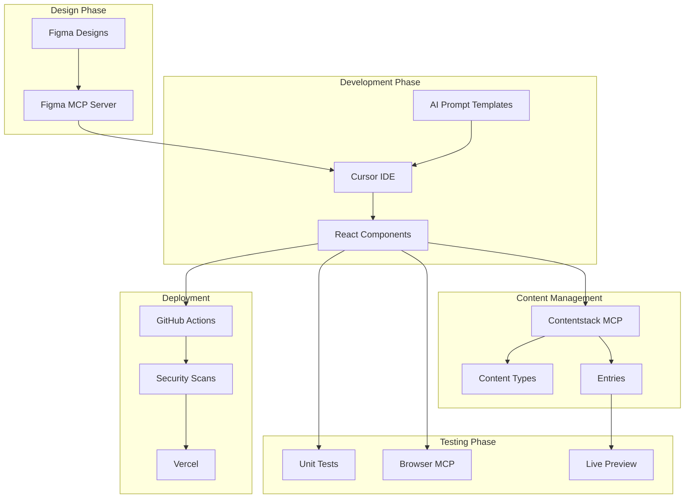
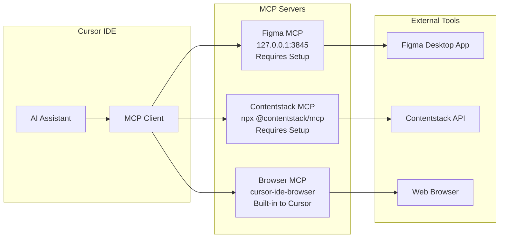
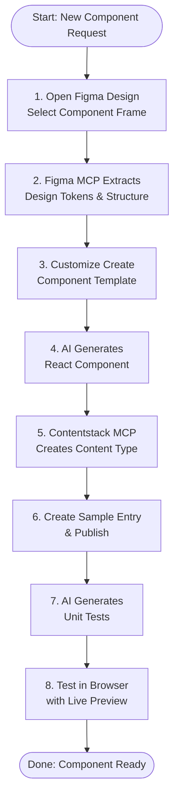
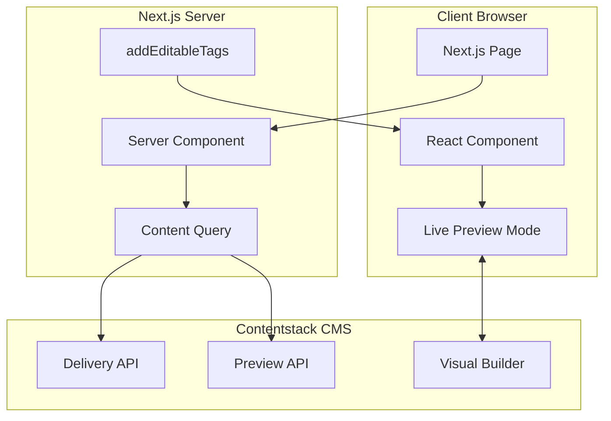
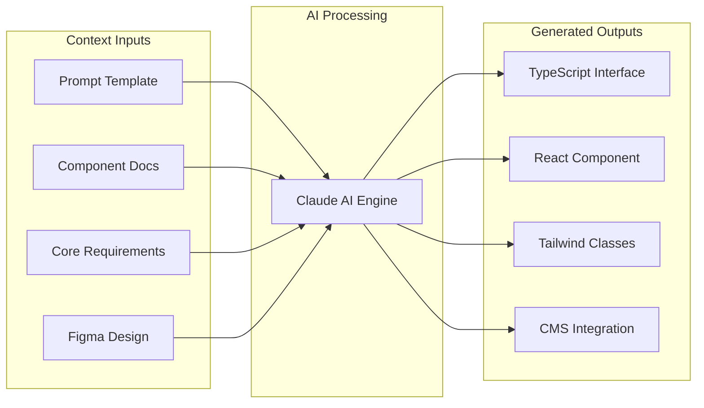
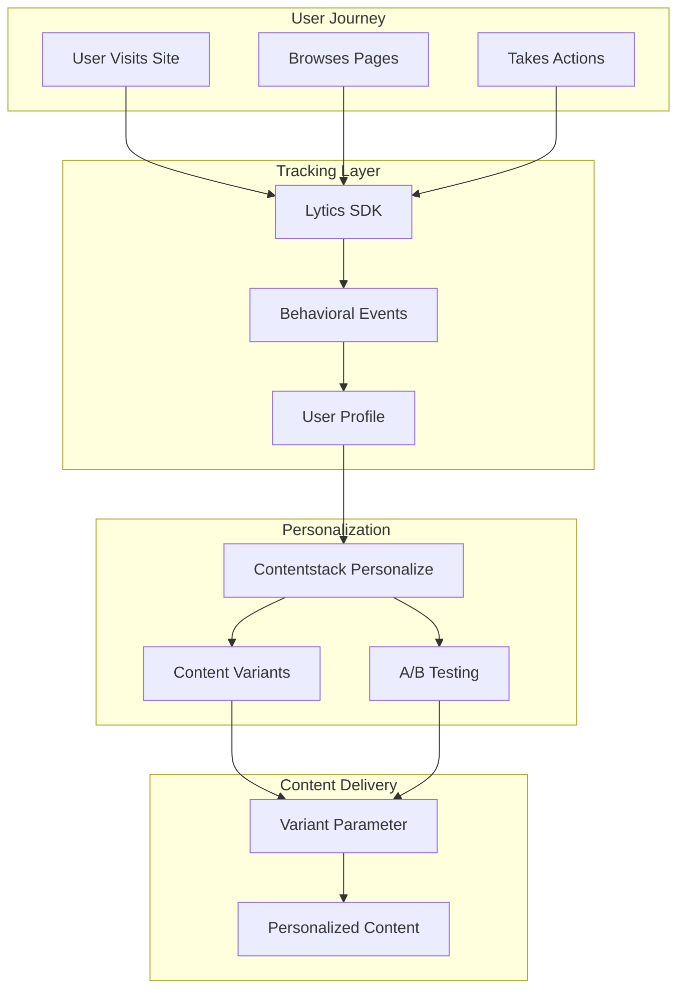
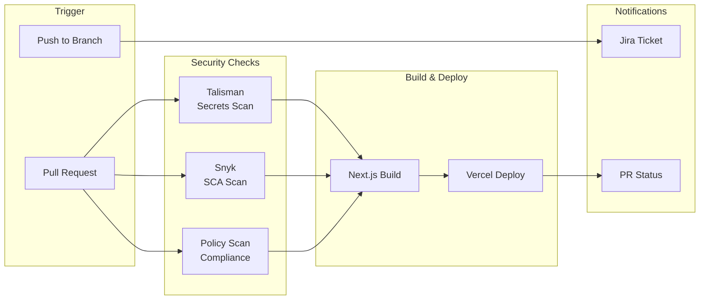
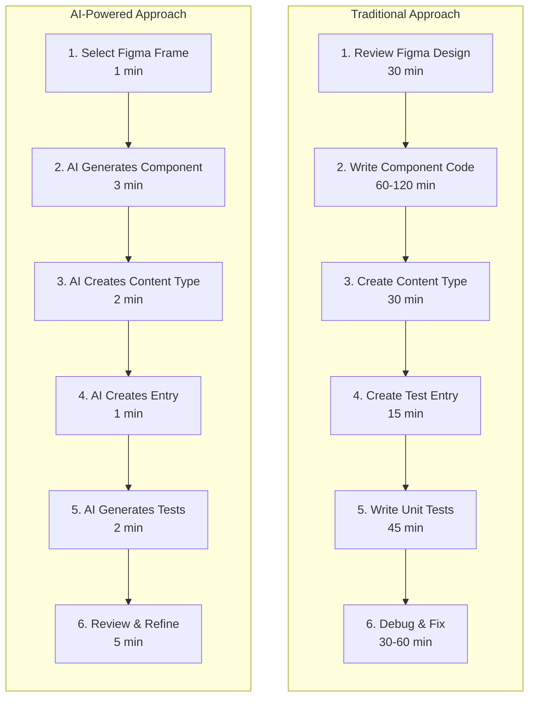

# Architecture Diagrams for Webinar

## Collection of Mermaid diagrams for use in the AI in SDLC webinar slides

---

## Diagram 1: Complete AI-Powered SDLC Flow

This diagram shows the complete flow from design to deployment with AI integration at each phase.

---

## Diagram 2: MCP Server Architecture

This diagram shows how MCP servers connect the IDE to external tools.

---

## Diagram 3: Component Development Workflow

This diagram shows the step-by-step process for creating a new component.

---

## Diagram 4: Contentstack Integration Pattern

This diagram shows how components integrate with Contentstack CMS.

---

## Diagram 5: AI Prompt Template System

This diagram shows how AI prompt templates ensure consistent code generation.

---

## Diagram 6: Personalization Architecture

This diagram shows the Lytics and Contentstack Personalize integration.

---

## Diagram 7: CI/CD Pipeline

This diagram shows the automated deployment pipeline with security checks.

---

## Diagram 8: Traditional vs AI-Powered SDLC Comparison

This diagram compares the traditional workflow with the AI-powered approach.

**Time Comparison:**
- Traditional: 3.5 - 5.5 hours
- AI-Powered: 15 - 20 minutes

---

## Diagram 9: FastLane Technology Stack

This diagram shows the complete technology stack used in FastLane.

```mermaid
flowchart TB
    subgraph frontend [Frontend Layer]
        NextJS[Next.js 14+<br/>App Router]
        React[React 18]
        TypeScript[TypeScript]
        Tailwind[Tailwind CSS]
        ShadCN[ShadCN UI]
    end
    
    subgraph cms [CMS Layer]
        Contentstack[Contentstack CMS]
        LivePreview[Live Preview SDK]
        Personalize[Personalize SDK]
    end
    
    subgraph ai [AI Layer]
        Cursor[Cursor IDE]
        FigmaMCP[Figma MCP]
        CSMCP[Contentstack MCP]
        Prompts[AI Prompt Templates]
    end
    
    subgraph analytics [Analytics Layer]
        Lytics[Lytics CDP]
        Tracking[Behavioral Tracking]
        Segments[Audience Segments]
    end
    
    subgraph devops [DevOps Layer]
        GitHub[GitHub Actions]
        Vercel[Vercel]
        Security[Security Scanning]
    end
    
    NextJS --> React
    React --> TypeScript
    TypeScript --> Tailwind
    Tailwind --> ShadCN
    
    Contentstack --> LivePreview
    Contentstack --> Personalize
    
    Cursor --> FigmaMCP
    Cursor --> CSMCP
    Cursor --> Prompts
    
    Lytics --> Tracking
    Tracking --> Segments
    
    GitHub --> Vercel
    GitHub --> Security
```

---

## Usage Instructions

### Converting to Slides

1. **Mermaid Live Editor:**
   - Go to https://mermaid.live
   - Paste diagram code
   - Export as PNG or SVG

2. **VS Code Extension:**
   - Install "Markdown Preview Mermaid Support"
   - Preview diagrams in editor
   - Screenshot for slides

3. **Presentation Tools:**
   - Marp (Markdown to slides)
   - Slidev (Vue-based slides)
   - Reveal.js (HTML slides)

### Customization

- Adjust node text for different audiences
- Add company branding to exported images
- Simplify for high-level overviews
- Expand for technical deep-dives

---

## Color Reference

When exporting diagrams, consider applying consistent colors:

| Element | Suggested Color |
|---------|----------------|
| Design Phase | Blue (#3B82F6) |
| Development Phase | Green (#10B981) |
| CMS Phase | Purple (#8B5CF6) |
| Testing Phase | Orange (#F59E0B) |
| Deployment Phase | Red (#EF4444) |

---

*These diagrams can be rendered using any Mermaid-compatible tool or exported as images for presentation software.*
